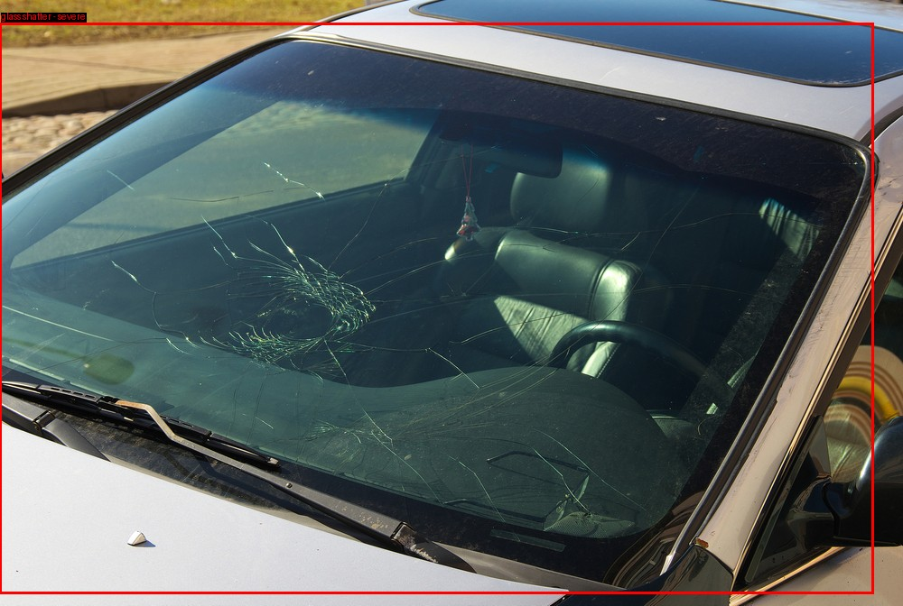
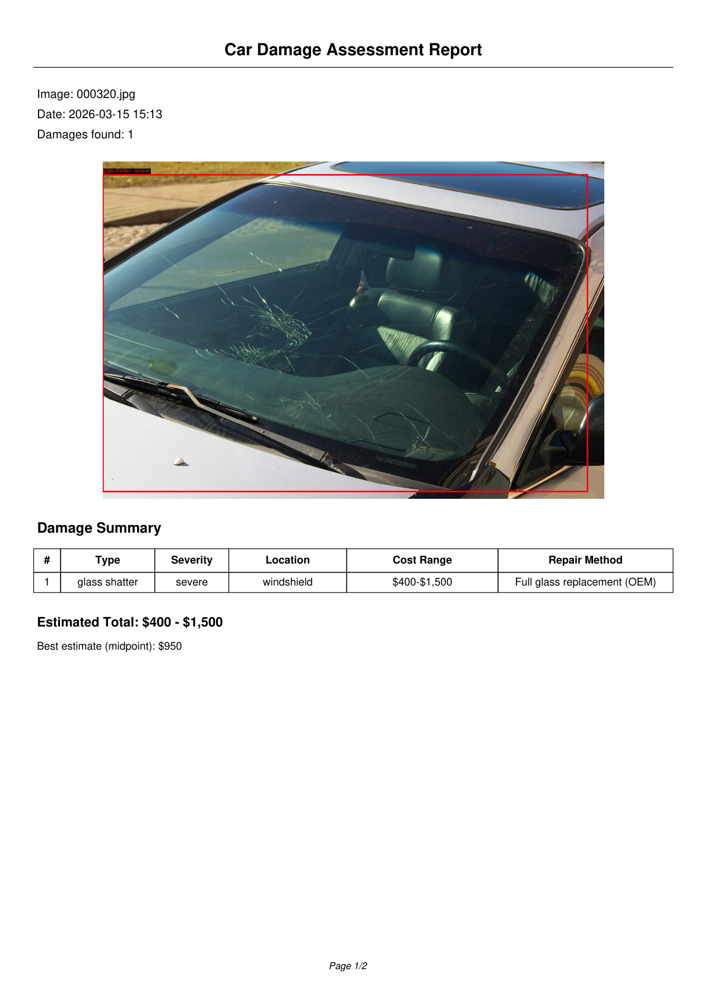
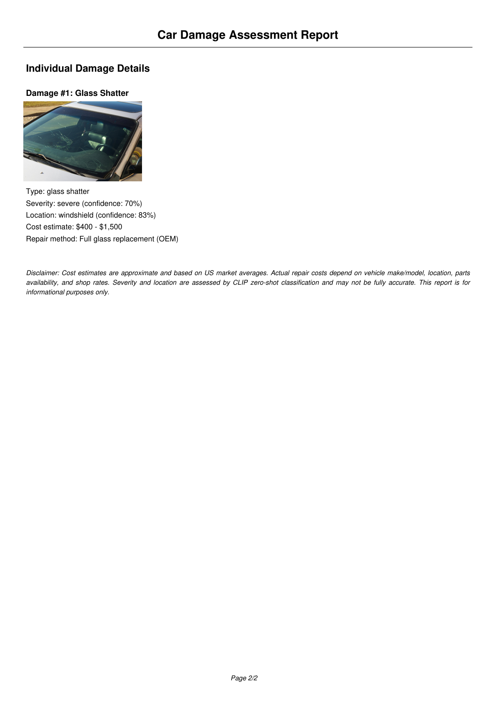
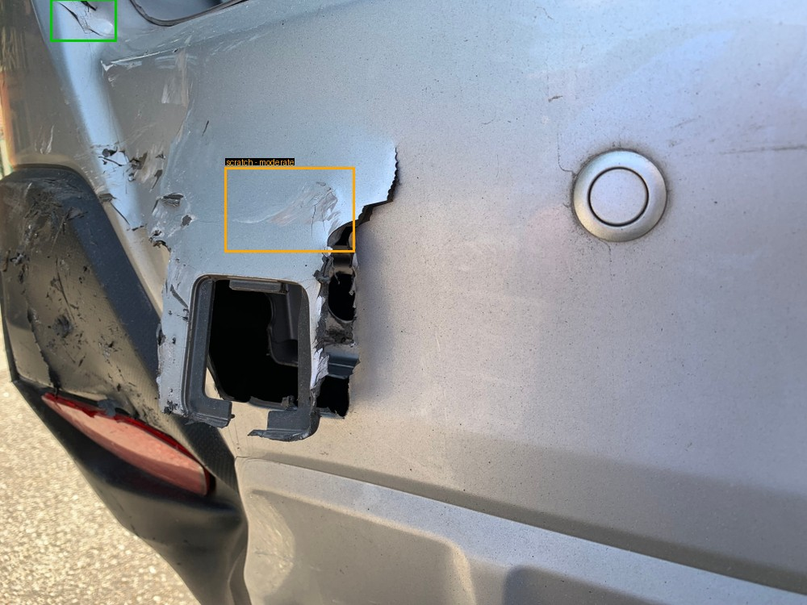
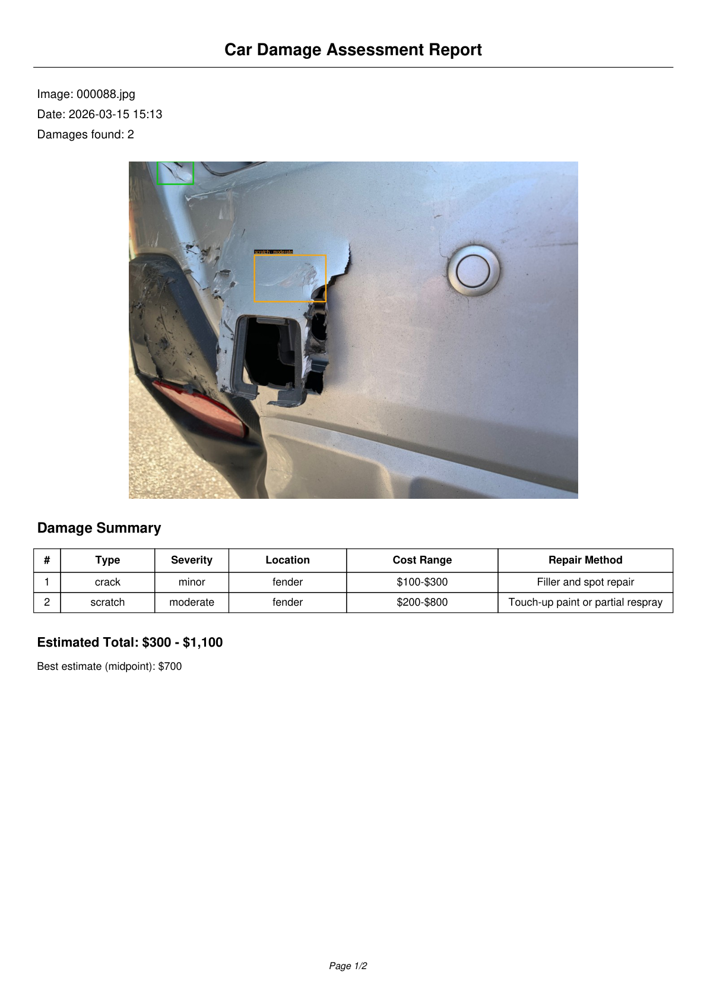
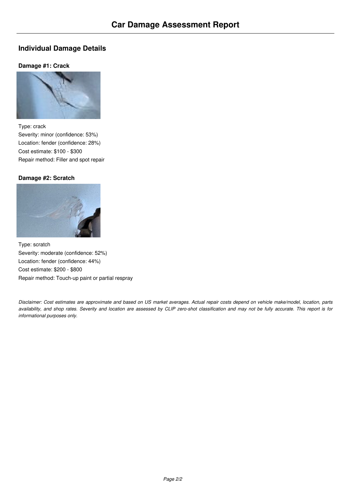
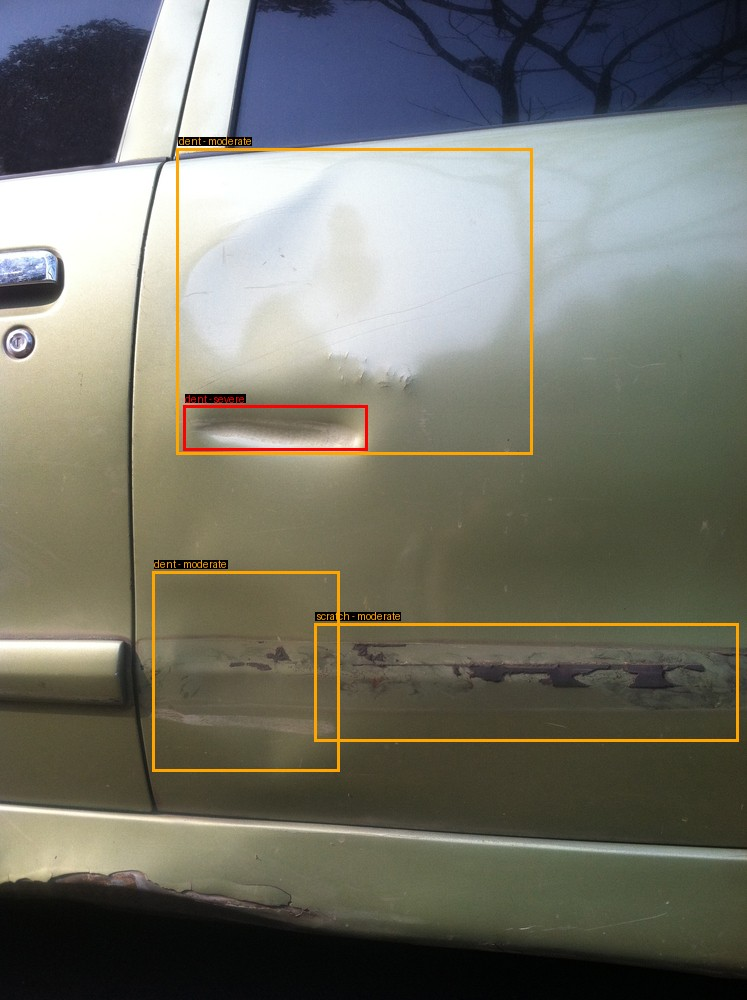
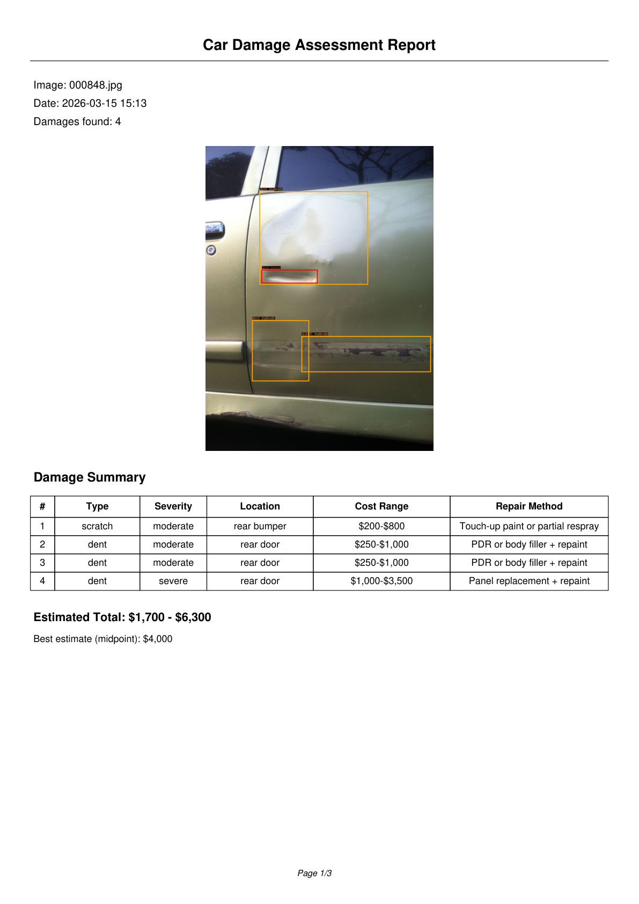
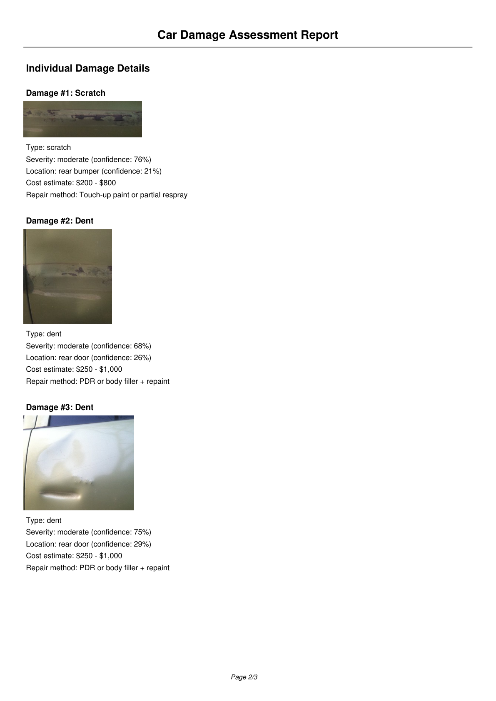
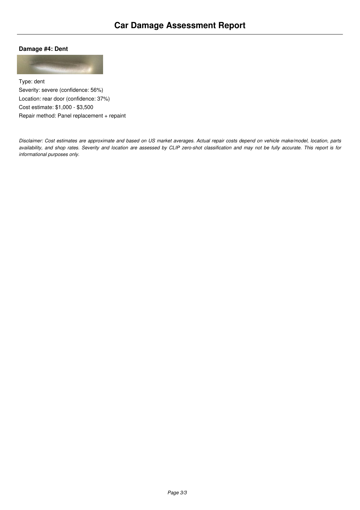

# Car Damage Detection & Assessment System

End-to-end pipeline for detecting, classifying, and estimating repair costs for vehicle damage.

**Image in → PDF report out.**

```
Input Image → YOLO Detection → CLIP Severity & Location → Cost Estimation → PDF Report
```

Built with **YOLOv11m** (object detection), **CLIP** (zero-shot severity/location classification), and **fpdf2** (report generation).

---

## 1. Pipeline Overview

```
Input Image
    │
    ▼
Step 1: YOLO Detection
    Detects all damages in the image
    → bounding boxes + damage type + confidence
    │
    ▼ (for each detection)
Step 2: Crop damage region (with 15% padding for context)
    │
    ├─ Step 3a: CLIP Severity (analyzes the CROP)
    │  Compares crop against text prompts like
    │  "a deep scratch exposing bare metal"
    │  → minor / moderate / severe
    │
    ├─ Step 3b: CLIP Location (analyzes the FULL IMAGE)
    │  Sends full image with red rectangle highlighting
    │  the damage bbox → hood / door / bumper / etc.
    │
    └─ Step 4: Cost Estimation
       Lookup table: (damage_type + severity) → price range
       → e.g. moderate scratch → $200-$800
    │
    ▼
Step 5: PDF Report
    → annotated image + summary table + per-damage details + total cost
```

### Usage

```bash
# Single image → PDF report + JSON
python scripts/full_pipeline.py car_photo.jpg

# Batch mode — all images in a folder
python scripts/full_pipeline.py car_photos/ --batch

# Custom confidence threshold
python scripts/full_pipeline.py car_photo.jpg --conf 0.5
```

---

## 2. YOLO Detection — Training & Results

We trained **YOLOv11m** (20M parameters) for 100 epochs using transfer learning from COCO pretrained weights. The model was trained on 2,816 training images and evaluated on 810 validation images after each epoch.

### Training Configuration

| Parameter | Value | Notes |
|-----------|-------|-------|
| Model | YOLOv11m | 20M parameters, COCO pretrained |
| Image size | 640px | Standard YOLO input |
| Batch size | 8 | Fits in 6GB VRAM |
| Optimizer | SGD | lr=0.01 (fresh), lr=0.001 (continue) |
| Epochs | 100 | With early stopping patience=100 |
| GPU | RTX 3060 6GB | ~2 min/epoch |

### Augmentations (training only)

| Augmentation | Value | Description |
|-------------|-------|-------------|
| Mosaic | 0.5 | Combines 4 images into one (50% probability) |
| Horizontal flip | 0.5 | Left-right flip (50% probability) |
| Rotation | +/-15 deg | Random rotation |
| Translation | 0.2 | Random shift up to 20% |
| Scale | 0.5 | Random zoom 50%-150% |

> Augmentations are applied to the **training** images only. Validation and test images are evaluated clean, without any augmentation.

### Training Curves

Training and validation metrics over 100 epochs — the loss decreases steadily and mAP plateaus around epoch 60-80, showing the model converged without overfitting:


### Confidence Threshold Selection (from validation set)

We use a confidence threshold of **0.35** for the pipeline (default YOLO is 0.25).

**How was this chosen?** By looking at the **validation set's** F1-Confidence curve. The F1 score balances precision (how many detections are correct) and recall (how many real damages are found). The F1 curve peaks around 0.35-0.40 for most classes, so 0.35 gives the best tradeoff:

- **Lower (0.25):** More detections, but includes low-confidence predictions that may be false positives
- **0.35 (chosen):** Best F1 tradeoff — catches most real damages while filtering out noise
- **Higher (0.50):** Fewer false positives, but misses some real damages (lower recall)

The threshold was selected from the **validation set** (not test set) to avoid data leakage — the test set is only used for final evaluation, never for tuning.


### Test vs Validation Comparison

After training and threshold selection, we evaluated the final model on the **374 test images** it has never seen:

| Metric | Validation | Test |
|--------|-----------|------|
| **mAP50** | **0.737** | **0.742** |
| **mAP50-95** | **0.577** | **0.575** |
| Precision | 0.776 | 0.781 |
| Recall | 0.695 | 0.697 |

**The validation and test scores are nearly identical.** This confirms the model **generalizes well** and is **not overfitting** — it performs just as well on completely new images as it does on the validation set used during training. This is exactly what we want: the validation set was a reliable proxy for real-world performance.

### Test Set Per-Class Performance

| Class | mAP50 | Precision | Recall | Why? |
|-------|-------|-----------|--------|------|
| glass shatter | 0.987 | 0.912 | 0.986 | Shattered glass has a very distinctive visual pattern — easy for the model to learn |
| tire flat | 0.923 | 0.969 | 0.844 | Flat tires have a unique shape that stands out from normal tires |
| lamp broken | 0.909 | 0.921 | 0.783 | Broken headlights/taillights have clear broken glass and housing damage |
| dent | 0.640 | 0.706 | 0.585 | Dents are subtle — they're deformations in metal that depend on lighting and viewing angle |
| scratch | 0.621 | 0.679 | 0.567 | Scratches are thin surface marks that can be hard to see, especially at low resolution |
| crack | 0.375 | 0.501 | 0.417 | Cracks are both rare (898 annotations vs 3,595 for scratch) and visually subtle |

**Pattern:** Classes with distinctive, high-contrast visual features (shattered glass, flat tires, broken lamps) are detected with 90%+ mAP. Subtle damage types (dents, scratches, cracks) that depend on lighting, angle, and resolution score lower. Crack is the hardest class — it has both the fewest training samples and the most subtle visual appearance.

### Test Set Predictions

Model predictions on the held-out test set (never seen during training or validation) alongside ground truth labels:


### Test Set Confusion Matrix


### Test Set PR Curve


---

## 3. CLIP-based Damage Assessment

Beyond detection, the system uses **CLIP (Contrastive Language-Image Pretraining)** to assess each detected damage — classifying its **severity** and **car panel location** without any additional training.

### What is CLIP?

CLIP is a vision-language model from OpenAI. It takes an image and a list of text descriptions, and scores how well each text matches the image. We use this for **zero-shot classification** — no training needed, no labeled severity data required.

### How It Works

For each bounding box detected by YOLO, we run two CLIP classifications:

**Severity classification** (uses the **cropped** damage region):
- We crop the bounding box from the image (with 15% padding around it for context)
- CLIP compares the crop against 3 text prompts per damage type (minor / moderate / severe)
- Example for scratch: "a photo of a light surface scratch, paint still intact" vs "a photo of a deep scratch exposing bare metal"
- We use the **crop** so CLIP sees the damage up close — it can judge depth, texture, and material exposure

**Location classification** (uses the **full image** with red rectangle):
- We draw a red rectangle on the full car image around the bounding box
- CLIP compares against 17 location prompts: "damage on a car hood", "damage on a car front door", etc.
- We use the **full image** because a crop loses spatial context — you can't tell if a scratched surface is a hood or a door without seeing the whole car

### Why CLIP? Alternatives Considered

| Approach | Accuracy | Speed | Effort | Cost | Offline |
|----------|----------|-------|--------|------|---------|
| **CLIP Zero-Shot (chosen)** | Moderate (~50-70% conf.) | Medium | Very low | Free | Yes |
| Custom CNN Classifier | High (80-90%+) | Fast | High (needs labeled data) | Free | Yes |
| Rule-Based (bbox size) | Low | Very fast | Low | Free | Yes |
| Fine-Tuned CLIP | High | Medium | Medium (needs some labels) | Free | Yes |
| LLM Vision API (GPT-4V) | Very high | Slow | Very low | $$$ per image | No |

**Advantages of CLIP zero-shot:**
- No training or fine-tuning needed — works out of the box
- No labeled severity data required (the CarDD dataset has no severity annotations)
- Easy to modify — changing classification categories only requires editing text prompts
- Runs locally, no API costs, no internet required

**Disadvantages of CLIP zero-shot:**
- Moderate confidence scores (~50-70%) — CLIP is a general-purpose model, not specialized for car damage
- Severity is subjective — there is no ground truth to validate against
- Location accuracy depends on how much of the car is visible in the image
- Slower than a small custom CNN (CLIP is a large model)
- Results depend heavily on prompt wording — different prompts can give different results

### Cost Estimation

A simple lookup table maps (damage_type + severity) to an estimated USD repair cost range:

| Damage Type | Minor | Moderate | Severe |
|------------|-------|----------|--------|
| Scratch | $50-$200 (buffing) | $200-$800 (touch-up/respray) | $800-$2,500 (full repaint) |
| Dent | $75-$250 (PDR) | $250-$1,000 (filler+repaint) | $1,000-$3,500 (panel replace) |
| Crack | $100-$300 (filler) | $300-$1,200 (partial repair) | $1,200-$4,000 (panel replace) |
| Glass shatter | $50-$150 (chip repair) | $200-$600 (aftermarket) | $400-$1,500 (OEM replace) |
| Lamp broken | $50-$200 (lens repair) | $150-$500 (aftermarket) | $300-$1,500 (OEM assembly) |
| Tire flat | $20-$50 (patch/plug) | $100-$300 (tire replace) | $200-$800 (tire+rim) |

> These are approximate US market averages. Actual costs depend on vehicle make/model, location, parts availability, and shop rates.

### Known Limitations

- **Text prompt max length is 77 tokens** — CLIP truncates anything longer. Our prompts are ~12 tokens so this is not an issue, but it limits how descriptive prompts can be.
- **Image gets resized to 224x224** — CLIP's input resolution is fixed. A tiny scratch in a large image may lose detail after resizing. This is why we crop first — the crop gets resized to 224x224 so the damage fills the frame.
- **No ground truth for severity** — the CarDD dataset does not include severity labels, so there is no way to objectively measure severity accuracy. Results are based on CLIP's visual judgment.
- **Single-image analysis only** — each image is analyzed independently. The system cannot combine views from multiple angles of the same car.
- **Sensitivity to image quality** — blurry, dark, or very close-up images may reduce CLIP's classification accuracy.
- **CLIP is not car-specific** — it's a general vision-language model trained on internet images. It understands "scratch" and "dent" broadly, but not with the precision of an auto body expert.

---

## 4. Full Pipeline Demo — Results on Test Images

These are real outputs from the full pipeline running on **test images** — images the model has never seen during training or validation. Each image produces a PDF report with annotated image, damage summary table, individual damage details, and total cost estimate.

### Demo 1: Glass Shatter (image 000320)



**YOLO detected:** 1 damage — glass shatter with 94% confidence.

**CLIP assessment:**
- **Severity: severe (70% confidence)** — the windshield is completely shattered with a dense spiderweb crack pattern covering the entire glass surface. CLIP correctly identifies this as severe because the glass is not just chipped or cracked — it's fully compromised with no intact area remaining.
- **Location: windshield (83% confidence)** — this is the highest location confidence across all demos. The shattered glass clearly fills the entire windshield area, making it unambiguous for CLIP.

**Cost estimate:** $400 - $1,500 (full OEM glass replacement)

**Why these results make sense:** Glass shatter is the easiest damage type for both YOLO (98.7% mAP) and CLIP. The visual pattern is unmistakable — spiderweb cracks across a flat glass surface. This is the kind of case where the pipeline works best.

**Generated PDF report:**





### Demo 2: Scratch + Crack (image 000088)



**YOLO detected:** 2 damages — a crack (59% confidence) and a scratch (35% confidence).

**CLIP assessment:**
- **Crack: minor severity (53%)** — the crack is small and confined to one area. CLIP's scores were close between minor (53%) and severe (42%), showing uncertainty — cracks are visually ambiguous for CLIP since a small crack and the edge of a large crack can look similar in a crop.
- **Scratch: moderate severity (52%)** — nearly tied with minor (46%), suggesting this is a borderline case. The scratch shows some primer underneath but the paint isn't fully removed — a textbook moderate case, though CLIP is not confident.
- **Both located on fender (28% and 44%)** — the damage is near the wheel arch area. The scratch has higher location confidence because the surrounding fender/wheel context is more visible in that part of the image.

**Cost estimate:** $300 - $1,100 total (filler repair + touch-up paint)

**Why these results make sense:** Scratches and cracks are the hardest damage types for YOLO (62% and 37% mAP respectively). The lower YOLO confidence (35% for the scratch — barely above our 0.35 threshold) and the lower CLIP severity confidence (52-53%) reflect the genuine difficulty of these subtle damage types.

**Generated PDF report:**





### Demo 3: Multiple Damages (image 000848)



**YOLO detected:** 4 damages — 1 scratch (76% confidence) and 3 dents (68%, 45%, 42% confidence).

**CLIP assessment:**
- **Scratch: moderate (76% confidence)** — this is the highest CLIP severity confidence across all demos. The scratch clearly shows primer underneath the surface paint, which matches the "moderate" prompt describing "visible scratch showing primer underneath". CLIP located it on the rear bumper (21%) — low confidence because several panels scored similarly (fender 20%, rear bumper 21%, rear door 19%).
- **Dent #1: moderate (68%)** — a noticeable dent on the rear door panel (26% location confidence). The panel shows visible deformation that needs body work but isn't completely crushed.
- **Dent #2: moderate (75%)** — the largest dent covering a significant area of the rear door (29% location confidence). Despite its size, CLIP classified it as moderate rather than severe because the panel is deformed but not torn or pierced.
- **Dent #3: severe (56%)** — a narrow but deep crease along the body line. CLIP's lower confidence (56%) shows it's a borderline case between moderate (39%) and severe (56%), which makes sense — deep creases along body lines are among the hardest dents to repair because they affect structural lines.

**Cost estimate:** $1,700 - $6,300 total (touch-up paint + body filler + panel replacement)

**Why these results make sense:** This is the most complex case — multiple damages on the same car. The dents are all on the rear door area, which CLIP consistently identifies despite moderate confidence. The severe dent has the highest cost ($1,000-$3,500) because panel replacement is the most expensive repair type. The total $1,700-$6,300 range reflects the reality that a car with 4 damages on the rear section likely had a significant rear-end impact.

**Generated PDF report:**







### Summary — What Works Well and What Doesn't

| Scenario | YOLO | CLIP Severity | CLIP Location | Overall |
|----------|------|---------------|---------------|---------|
| Glass/lamp/tire (distinctive) | Very high conf. (90%+) | High conf. (60-70%) | High conf. (80%+) | Reliable |
| Dents (moderate) | Good conf. (40-70%) | Good conf. (65-75%) | Moderate conf. (25-35%) | Reasonable |
| Scratches/cracks (subtle) | Lower conf. (35-60%) | Lower conf. (50-55%) | Lower conf. (20-45%) | Use with caution |

The pipeline works best for visually obvious damage (shattered glass, flat tires, broken lamps) and gives reasonable estimates for moderate damage (dents). For subtle damage (light scratches, hairline cracks), both detection and classification confidence are lower — results should be treated as approximate.

---

## 5. Dataset — CarDD (Car Damage Detection)

The [CarDD dataset](https://cardd-ustc.github.io/) contains 4,000 real-world car damage images with 9,740 bounding box annotations across 6 damage categories.

### Data Splits

| Split | Images | Purpose |
|-------|--------|---------|
| **Train** | 2,816 | Model learns from these images (with augmentations) |
| **Validation** | 810 | Evaluated after each epoch to track performance, tune the confidence threshold, and select the best model checkpoint — the model **never trains** on these |
| **Test** | 374 | Final held-out evaluation — the model **never sees** these during training or validation |

### Damage Classes (6 total)

| Class | Train Annotations | Description |
|-------|-------------------|-------------|
| scratch | 3,595 | Surface scratches on body panels |
| dent | 2,543 | Dents and deformations |
| crack | 898 | Cracks in body/bumper |
| lamp broken | 704 | Broken headlights/taillights |
| glass shatter | 681 | Shattered windows/windshields |
| tire flat | 319 | Flat or damaged tires |

> **Note:** The dataset is imbalanced — scratches have 11x more annotations than tire flats. This imbalance is reflected in the per-class detection performance: scratch and crack (common but subtle) have lower mAP than glass shatter and tire flat (rare but visually distinctive).


### How Training, Validation, and Test Work

| Phase | Data Used | When | Purpose |
|-------|-----------|------|---------|
| **Training** | 2,816 images (with augmentation) | Every epoch | Model learns to detect damage by adjusting weights |
| **Validation** | 810 images (no augmentation) | After each epoch | Monitors performance to detect overfitting. The best model checkpoint is saved based on validation mAP |
| **Test** | 374 images (no augmentation) | After training is done | Final unbiased evaluation on completely unseen data |

- The model **only learns** from training images
- Validation images are used to **pick the best checkpoint** and **tune the confidence threshold** — they are **not** used for training
- Test images are a fully held-out set — used **only once** for final evaluation

---

## Quick Start

### 1. Setup

```bash
python -m venv venv
venv\Scripts\activate        # Windows
# source venv/bin/activate   # Linux/Mac
pip install -r requirements.txt
```

### 2. Prepare Dataset

Download the [CarDD dataset](https://cardd-ustc.github.io/) and place it in `CarDD_release/`, then convert to YOLO format:

```bash
python prepare_all_classes.py
```

This creates `CarDD_YOLO_6classes/` with the proper train/val/test splits in YOLO format.

### 3. Train

```bash
python train_yolo11_all_classes.py
```

Edit the top of the script to configure:
- `MODE = 'fresh'` — start from scratch with COCO pretrained weights
- `MODE = 'continue'` — fine-tune from your existing `best.pt` (uses lower learning rate)
- `EPOCHS = 100` — number of training epochs

### 4. Run Full Pipeline

```bash
# Single image → PDF report + JSON
python scripts/full_pipeline.py car_photo.jpg

# Batch mode — all images in a folder
python scripts/full_pipeline.py car_photos/ --batch

# Custom confidence threshold
python scripts/full_pipeline.py car_photo.jpg --conf 0.5
```

Output: PDF report + JSON file saved to `reports/`.

Or use components individually in Python:

```python
from ultralytics import YOLO
from scripts.clip_classifier import CLIPDamageClassifier, crop_damage_region
from scripts.cost_estimator import estimate_cost

# Step 1: Detect damages
model = YOLO('runs/detect/yolo11m_cardd_6classes/weights/best.pt')
results = model('car_image.jpg', conf=0.35)

# Step 2: Analyze each detection with CLIP
clip = CLIPDamageClassifier()
# ... crop, classify severity, classify location

# Step 3: Estimate costs
cost = estimate_cost("scratch", "moderate")
# → {"min_cost": 200, "max_cost": 800, "method": "Touch-up paint or partial respray"}
```

---

## Upgrade Path

1. **V1 (current):** CLIP zero-shot — works out of the box with no labeled data
2. **V2:** Fine-tune CLIP or train a small CNN once real-world severity feedback is collected
3. **V3:** Hybrid — specialized CNN for severity, CLIP for location, LLM for written report generation

---

## Project Structure

```
train_yolo11_all_classes.py         # Main training script (fresh / continue modes)
prepare_all_classes.py              # Convert CarDD dataset to YOLO format
requirements.txt                    # Python dependencies

scripts/
    full_pipeline.py                # Full pipeline: image → YOLO → CLIP → cost → PDF
    clip_classifier.py              # CLIP-based severity and location classifier
    cost_estimator.py               # Cost estimation lookup table
    report_generator.py             # PDF report generation

results/                            # Result images (for this README)
    training_curves/                # Loss curves, mAP, PR, F1 plots
    confusion_matrix/               # Validation confusion matrices
    test_set/                       # Test set evaluation results
    pipeline_demo/                  # Annotated images + PDF screenshots from demos
    class_distribution/             # Dataset class distribution

reports/                            # Generated PDF reports (pipeline output)
    demo_report_glass_shatter.pdf   # Demo: glass shatter → severe, windshield
    demo_report_scratches_and_cracks.pdf  # Demo: crack + scratch
    demo_report_multiple_damages.pdf      # Demo: 4 damages on one car

runs/detect/yolo11m_cardd_6classes/ # Full training output (gitignored)
    weights/best.pt                 # Best model weights
    weights/last.pt                 # Last epoch weights
    results.csv                     # Per-epoch metrics

docs/                               # Technical documentation
    TRAINING_PROCESS_EXPLAINED.md   # How YOLO training works
    TRANSFER_LEARNING_EXPLAINED.md  # Transfer learning concepts
    MODEL_COMPARISON.md             # YOLO model size comparison
    YOLO_VERSION_COMPARISON.md      # YOLOv8 vs YOLOv11
```

---

## Requirements

- Python 3.8+
- NVIDIA GPU with CUDA support
- 6GB+ VRAM (tested on RTX 3060 Laptop GPU)

```bash
pip install -r requirements.txt
```

Key dependencies:
- `ultralytics` — YOLOv11 framework
- `transformers` — CLIP model (HuggingFace)
- `torch` — PyTorch with CUDA
- `fpdf2` — PDF report generation
- `Pillow` — image processing

---

## Acknowledgments

- [Ultralytics](https://github.com/ultralytics/ultralytics) — YOLOv11 framework
- [CarDD Dataset](https://cardd-ustc.github.io/) — Car Damage Detection Dataset (Wang et al.)
- [OpenAI CLIP](https://github.com/openai/CLIP) — Vision-language model for zero-shot classification
